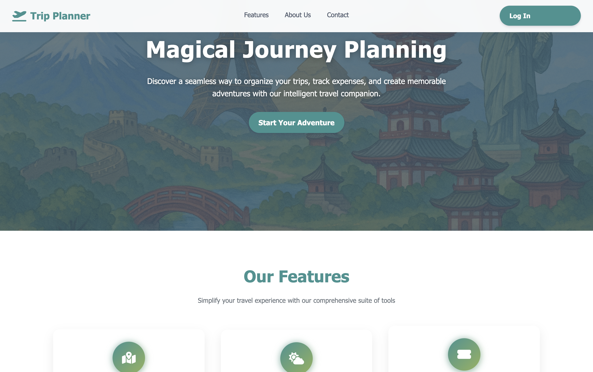
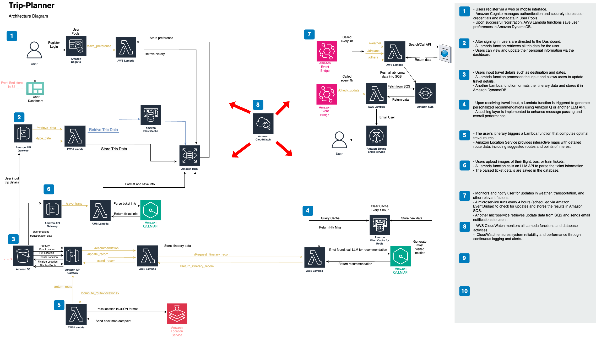
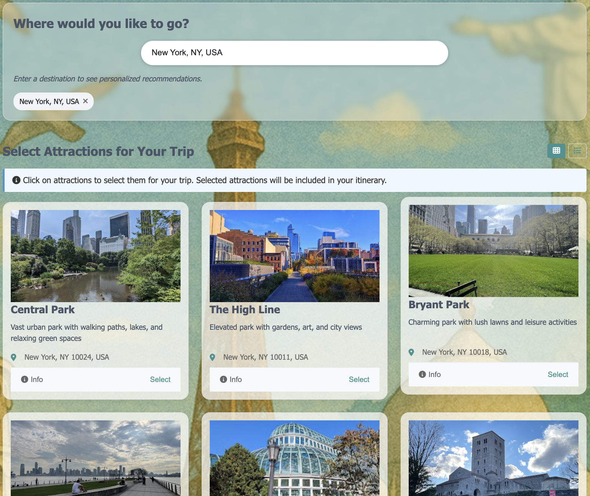
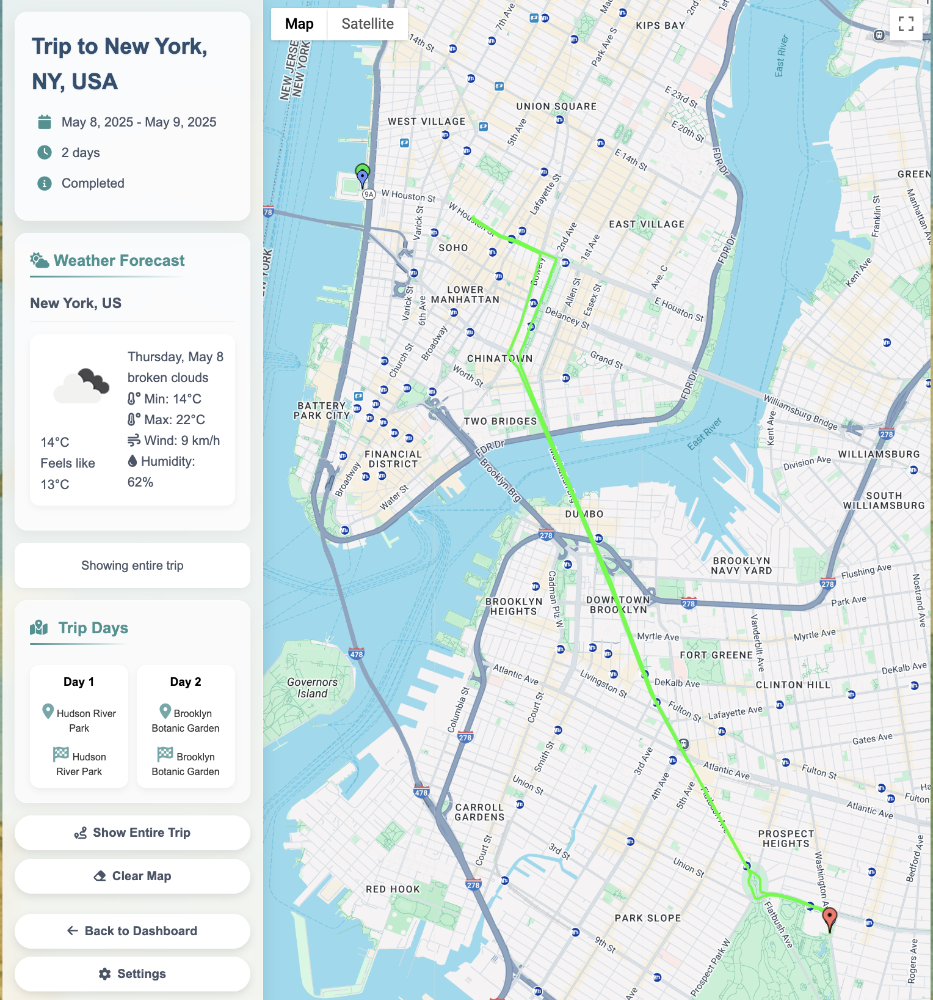

# Travel Planner



## Project Overview
This is a serverless architecture full-stack travel planning application. It integrates AWS cloud services, relational databases, and large language models (LLM) to help users generate multi-day travel itineraries based on preferences, weather information, and uploaded ticket information.

It demonstrates practical implementation of serverless architecture principles and cloud-native application development using AWS services.

## Key Features
- Personalized travel recommendations based on user preferences
- Dynamic itinerary adjustments using real-time weather data
- Flight status monitoring with delay/cancellation notifications 
- PDF/image ticket processing to extract departure locations, times, and other key information
- Secure authentication using AWS Cognito
- User and trip data storage in AWS Aurora MySQL database
- Google Maps integration for route planning and visualization
- Image storage and retrieval via AWS S3 for trip destinations
- Mobile-responsive frontend with dark mode support

## System Architecture


The frontend (HTML/JS/CSS) is deployed on S3 and communicates with the backend via API Gateway. The Gateway routes requests to various Lambda functions, which connect to the Aurora MySQL database and/or external APIs (OpenAI, weather API, flight API). For asynchronous tasks like email notifications, SQS is used as a message queue.

### Detailed Architecture Components
- **Authentication Flow**: Users register and login through a custom UI that interfaces with AWS Cognito
- **Trip Planning Pipeline**: 
  1. User inputs preferences and destination
  2. Lambda functions query external APIs for location data
  3. Results are processed and stored in Aurora MySQL
  4. Frontend retrieves and displays trip itinerary
- **Notification System**: 
  1. Lambda functions monitor flight statuses and weather changes
  2. Updates are sent to SQS queue
  3. Consumer Lambda processes the queue and sends emails via SES

## User Flow
1. **Registration/Login**: Users create an account or login with existing credentials
2. **Preference Setting**: Users set travel preferences (weather, environment, activities)
3. **Destination Selection**: Users select their travel destination and dates 
4. **Itinerary Generation**: System generates recommended itinerary based on preferences
5. **Itinerary Customization**: Users can add/remove/modify activities
6. **Trip Saving**: Users save their trip for future reference
7. **Trip Management**: Users can view, edit, clone, or delete saved trips 
8. **Flight Monitoring**: System monitors flight status and sends alerts if changes occur

## Deployment Steps
1. Clone the code repository
2. Configure environment variables (database credentials, API keys, etc.)
3. Deploy Lambda functions using AWS SAM or CloudFormation
4. Build the frontend and upload to S3 with website hosting enabled
5. Configure CloudWatch triggers for scheduled Lambda functions (weather updates, flight checks)
6. Set up API Gateway with proper CORS and authentication settings
7. Configure SQS queues and SES for email notifications

## Local Development Environment
To set up a local development environment:

1. **Prerequisites**:
   - Python (v3.9+)
   - AWS CLI configured with appropriate permissions
   - MySQL client

2. **Backend Setup**:
   ```bash
   cd Lambda/lambda_layer
   unzip pymysql_layer.zip
   # Configure local environment variables
   ```

3. **Frontend Setup**:
   ```bash
   cd Frontend
   # Open HTML files directly in browser or use a local server
   ```

4. **Testing Lambda Functions Locally**:
   - Use AWS SAM CLI for local Lambda testing
   - Or test Python functions directly with mock event data

## API Documentation
The application uses a RESTful API structure with the following endpoints:

### User Management API
- `GET /users` - Get user data
- `POST /users` - Create a new user
- `OPTIONS /users` - Preflight request support for CORS
- **User Preferences**:
  - `PUT /users/preferences` - Update user preferences
  - `OPTIONS /users/preferences` - Preflight request support for CORS
- **User Profile**:
  - `PUT /users/profile` - Update user profile information
  - `OPTIONS /users/profile` - Preflight request support for CORS

### Recommendation API
- `GET /recommendation` - Get personalized location recommendations based on preferences
- `OPTIONS /recommendation` - Preflight request support for CORS

### Routing API
- `GET /routing` - Get optimized routes for a trip
- `POST /routing` - Create a new route
- `OPTIONS /routing` - Preflight request support for CORS

### Ticket Management API
- `GET /tickets` - List all tickets
- `PUT /tickets` - Update ticket information
- `OPTIONS /tickets` - Preflight request support for CORS
- **Ticket Operations**:
  - `DELETE /tickets/{ticket_id}` - Delete a specific ticket
  - `OPTIONS /tickets/{ticket_id}` - Preflight request support for CORS

### Trip Management API
- `GET /trips` - List all user trips
- `POST /trips` - Create a new trip
- `OPTIONS /trips` - Preflight request support for CORS
- **Trip Operations**:
  - `GET /trips/{trip_id}` - Get details for a specific trip
  - `PUT /trips/{trip_id}` - Update a specific trip
  - `DELETE /trips/{trip_id}` - Delete a specific trip
  - `OPTIONS /trips/{trip_id}` - Preflight request support for CORS
  - **Trip Cloning**:
    - `POST /trips/{trip_id}/clone` - Create a copy of an existing trip
    - `OPTIONS /trips/{trip_id}/clone` - Preflight request support for CORS
  - **Trip Itinerary**:
    - `GET /trips/{trip_id}/itinerary` - Get the itinerary for a specific trip
    - `OPTIONS /trips/{trip_id}/itinerary` - Preflight request support for CORS

## Project Directory Structure
- **Lambda/**: AWS Lambda functions organized by functionality
  - User management (registration, preferences, profiles)
  - Trip management (creation, editing, cloning, deletion)
  - Data processing (weather reports, flight status)
  - Notification services (email sending)
- **Frontend/**: Web client interface
  - utils/: Shared JS, CSS, and theme files
  - pages/: Main application pages and views
  - dashboard/: User dashboard components
  - trip_card/: Trip visualization and management
- **Database/**: SQL schema definitions and migrations

## CI/CD Overview
- AWS SAM/CloudFormation for infrastructure automation
- GitHub Actions for automated testing and deployment
- S3 bucket versioning for frontend rollback capability

## Security Considerations
This application implements several security best practices:

- **Authentication**: User authentication via AWS Cognito
- **Authorization**: API Gateway and Lambda authorization checks
- **Data Protection**: Sensitive data encrypted at rest and in transit
- **Input Validation**: All user inputs are validated before processing
- **Secure Dependencies**: Regular updates to dependencies to patch vulnerabilities
- **Least Privilege**: IAM roles following least privilege principle

## Future Improvements
Potential enhancements for future versions:

- Machine learning model for personalized activity recommendations- Integration with more travel APIs (hotel bookings, car rentals)- Social features to share and collaborate on trips- Mobile app version using React Native- Offline capabilities for saved trips- Multi-language support## ContributorsThis project was developed by the Cloud Computing course team at NYU.## LicenseThis project is licensed under the MIT License - see the LICENSE file for details.