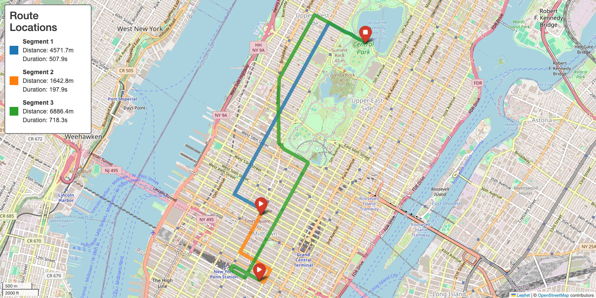

# Route Optimization Microservice

A microservice for optimizing multi-point routes using various transportation modes.

## Current Status

### Completed Features
- ✅ Basic route optimization using distance-based algorithms
- ✅ Support for multiple transportation modes (driving, walking, cycling)
- ✅ K-d tree optimization for large datasets
- ✅ Round-trip and non-round-trip route planning
- ✅ Distance and duration matrix calculations
- ✅ Comprehensive test coverage
- ✅ Mock provider for testing
- ✅ OSRM provider integration
- ✅ RESTful API endpoints
- ✅ Basic error handling
- ✅ Database storage for optimized routes
- ✅ Interactive API documentation (Swagger/OpenAPI)
- ✅ Route visualization with interactive maps
- ✅ Multi-day trip planning and visualization

### Pending Features
- ⚠️ API Integration
  - ✅ RESTful API endpoints
  - ✅ API documentation
  - ❌ Rate limiting
  - ❌ Request validation
  - ⚠️ Error handling middleware (basic implementation)

- ⚠️ Storage Management
  - ✅ Route history storage
  - ❌ Caching layer for frequently accessed routes
  - ✅ Database integration (PostgreSQL)
  - ✅ Data persistence

## Quick Start

The easiest way to get started is to use our automated setup script:

```bash
# Make the script executable
chmod +x setup.sh

# Run the setup script
./setup.sh
```

The setup script will:
1. Install Homebrew (if not installed)
2. Install PostgreSQL 14 (if not installed)
3. Create a Python virtual environment
4. Install all required dependencies
5. Set up the database and user
6. Create necessary configuration files
7. Run database migrations

After running the setup script, you can start the API server:
```bash
source venv/bin/activate
uvicorn app:app --reload
```

## Project Structure
```
project/
├── core/
│   ├── optimization/
│   │   └── route_optimizer.py    # Route optimization algorithms
│   ├── workflow/
│   │   └── route_planner.py      # Main orchestrator
│   └── visualization/
│       └── route_visualizer.py   # Route visualization tools
├── provider/
│   ├── base.py                  # Base classes and interfaces
│   ├── mock_provider.py         # Mock implementation
│   └── osrm_provider.py         # OSRM implementation
├── storage/
│   ├── db.py                    # Database connection setup
│   ├── models.py                # SQLAlchemy models
│   └── repositories/
│       └── route_repository.py  # Route data access layer
├── migrations/                  # Alembic database migrations
├── test/
│   ├── test_route_optimizer.py
│   ├── test_route_planner.py
│   └── test_route_visualizer.py
├── scripts/
│   └── ny_trip_planner.py      # Example script for multi-day trip planning
├── app.py                       # FastAPI application
├── config.py                    # Configuration settings
└── setup.sh                     # Automated setup script
```

## API Documentation

The API includes interactive documentation:

- **Swagger UI**: Available at `/docs` when the API is running
- **ReDoc**: Available at `/redoc` when the API is running

These interfaces allow you to:
- Browse all available endpoints
- View parameter details and examples
- Make test requests directly from the browser
- See response schemas and examples

## API Endpoints

### Health Checks
- `GET /health` - Check API health status
- `GET /` - Check API health status and environment

### Route Optimization
- `POST /optimize` - Optimize a route between multiple points
  ```json
  {
    "points": [
      {"lat": 40.7128, "lon": -74.0060},
      {"lat": 34.0522, "lon": -118.2437}
    ],
    "start_point": {"lat": 40.7128, "lon": -74.0060},  // Optional
    "end_point": {"lat": 34.0522, "lon": -118.2437},   // Optional
    "round_trip": true,                                // Optional, default: true
    "mode": "driving"                                  // Optional, default: driving
  }
  ```

### Matrix Calculations
- `GET /matrix/distance?points=lat1,lon1&points=lat2,lon2` - Get distance matrix between points
- `GET /matrix/duration?points=lat1,lon1&points=lat2,lon2` - Get duration matrix between points

### Trip-Specific Routes
- `POST /trips/{trip_id}/days/{day_number}/optimize` - Optimize and store a route for a specific day in a trip
  ```json
  {
    "locations": ["location-uuid-1", "location-uuid-2", "location-uuid-3"],
    "mode": "driving",
    "round_trip": true
  }
  ```
- `GET /trips/{trip_id}/days/{day_number}/route` - Get the optimized route for a specific day in a trip
- `GET /trips/{trip_id}/routes` - Get all optimized routes for a trip

## Database Schema

### Trips
```
trips
-----
id (UUID primary key)
name (string)
description (text)
start_date (timestamp)
end_date (timestamp)
created_at (timestamp)
updated_at (timestamp)
```

### Days
```
everyday
--------
id (UUID primary key)
trip_id (UUID, foreign key to trips.id)
day_number (integer)
description (text)
created_at (timestamp)
updated_at (timestamp)
```

### Locations
```
locations
---------
id (UUID primary key)
name (string)
address (string)
latitude (float)
longitude (float)
created_at (timestamp)
updated_at (timestamp)
```

### Optimized Routes
```
optimized_routes
----------------
id (UUID primary key)
everyday_id (UUID, foreign key to everyday.id)
total_distance (float) - total distance in meters
total_duration (float) - total duration in seconds
transport_mode (string) - driving, walking, cycling
round_trip (boolean) - whether this is a round trip
created_at (timestamp)
updated_at (timestamp)
```

### Route Segments
```
route_segments
--------------
id (UUID primary key)
route_id (UUID, foreign key to optimized_routes.id)
segment_order (int) - the order of segments in the route
start_location_id (UUID, foreign key to locations.id)
end_location_id (UUID, foreign key to locations.id)
distance (float) - segment distance in meters
duration (float) - segment duration in seconds
coordinates (JSON) - the full path coordinates for this segment
```

## Route Visualization

The service includes powerful route visualization features:

### Single-Day Route Visualization
- Bold, high-visibility route lines
- Different colors for each segment within a day
- Start and end point markers with matching colors
- Information sidebar showing location names
- Automatic zoom based on route bounds

### Multi-Day Trip Visualization
- Overview map showing all days' routes
- Each day's route in a distinct color
- Start and end points for each day
- Information sidebar showing day information
- Automatic zoom to show all routes

### Example Visualizations

#### Single-Day Route


#### Multi-Day Trip Overview


### Usage
```python
from core.visualization.route_visualizer import RouteVisualizer

# Initialize visualizer
visualizer = RouteVisualizer()

# Generate visualization for a single route
image_data = visualizer.visualize_route(route)

# Generate visualization for multiple days
image_data = visualizer.visualize_multi_day_routes(routes)

# Save to file
with open("route_map.png", "wb") as f:
    f.write(base64.b64decode(image_data))
```

## Example Scripts

### Multi-Day Trip Planner
The repository includes an example script for creating and visualizing multi-day trips:

```bash
# Run the example script
./scripts/run_script.sh ny_trip_planner.py
```

This script:
1. Creates a new trip
2. Adds multiple days with locations
3. Optimizes routes for each day
4. Generates visualizations for individual days and a multi-day overview

## Usage

### Python Client
```python
from core.workflow.route_planner import RoutePlanner
from provider.osrm_provider import OSRMProvider

# Initialize the route planner
provider = OSRMProvider()
planner = RoutePlanner(provider)

# Plan a route
points = [
    {"lat": 40.7128, "lon": -74.0060},  # New York
    {"lat": 34.0522, "lon": -118.2437}, # Los Angeles
    {"lat": 41.8781, "lon": -87.6298}   # Chicago
]

route = planner.plan_route(points, mode="driving", round_trip=True)
print(f"Total distance: {route.total_distance / 1000:.2f} km")
print(f"Total duration: {route.total_duration / 3600:.2f} hours")
```

### Multi-Day Trip Planning
```python
from storage.repositories.route_repository import RouteRepository
from core.visualization.route_visualizer import RouteVisualizer

# Initialize repositories
route_repo = RouteRepository(db_session)

# Create a trip with multiple days
trip_id = await create_trip(db_session, "New York Trip", "3-day trip to NYC")

# Add locations for each day
day1_locations = [
    {"name": "Times Square", "address": "Manhattan, NY", "latitude": 40.7580, "longitude": -73.9855},
    {"name": "Central Park", "address": "New York, NY", "latitude": 40.7829, "longitude": -73.9654},
    {"name": "Empire State Building", "address": "New York, NY", "latitude": 40.7484, "longitude": -73.9857}
]

# Add locations to the database
location_ids = []
for loc in day1_locations:
    location_id = await location_repo.create_location(
        name=loc["name"],
        address=loc["address"],
        latitude=loc["latitude"],
        longitude=loc["longitude"]
    )
    location_ids.append(location_id)

# Optimize route for day 1
await route_repo.optimize_route_for_day(
    trip_id=trip_id,
    day_number=1,
    location_ids=location_ids,
    transport_mode="driving",
    round_trip=True
)

# Get all routes for the trip
routes = await route_repo.get_routes_by_trip_id(trip_id)

# Visualize all routes
visualizer = RouteVisualizer()
image_data = visualizer.visualize_multi_day_routes(routes)

# Save visualization
with open("multi_day_routes.png", "wb") as f:
    f.write(base64.b64decode(image_data))
```